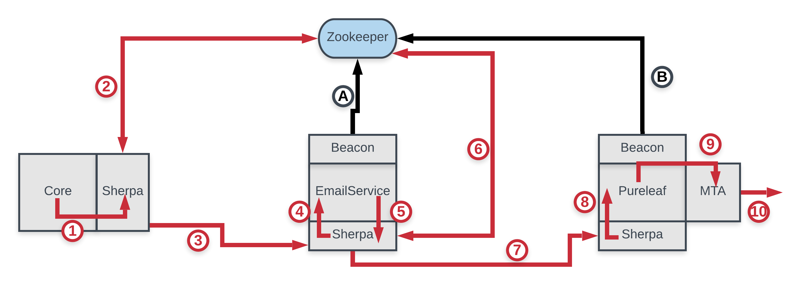

# Email Infra (EaaS)

https://git.soma.salesforce.com/eaas/EmailService

# Architecture
## Falcon

1. Core send the grpc email to `eaas.emailinfra.localhost.mesh.force.com:5443` which routes to the Sherpa sidecar
1. Sherpa(Core) looks up `emailinfra/eaas` on Zookeeper for its kingdom.
1. Sherpa(Core) sends the grpc request to Sherpa(Eaas) on port 7443 using mTLS.
1. Sherpa(Eaas) hands the grpc request (and the client certificate) to Eaas on `localhost:7020`
1. Eaas does stuff and hands off the email to the MTA on `localhost:25`
1. The MTA sends the mail to the MM Proxy with the external IP to send the mail out of.
1. The MM Proxy forwards the message to the internet.

A. Based on [manifest](https://git.soma.salesforce.com/sam/manifests/blob/4b0e0981240e232a872393956e6c48ef7d6bce28/apps/team/EmailInfra/eaas/manifest.yaml#L60) definition of beacon endpoint, Beacon will announce EmailService to Zookeeper on startup.   

## On Premise

1. Core send the grpc email to `eaas.emailinfra.localhost.mesh.force.com:5443` which routes to the Sherpa sidecar
1. Sherpa(Core) looks up `emailinfra/eaas` on Zookeeper for its kingdom.
1. Sherpa(Core) sends the grpc request to Sherpa(Eaas) on port 7443 using mTLS.
1. Sherpa(Eaas) hands the grpc request (and the client certificate) to Eaas on `localhost:7020`
1. Eaas does stuff and looks up MX record that core provided in EAAS_RELAY header or in the ip_pool field.
1. EaaS uses SMTP protocol (with its own pooling and retry logic) to hand email to MTA over port 25.
1. MTA sends the mail to the internet

A. Based on [manifest](https://git.soma.salesforce.com/sam/manifests/blob/4b0e0981240e232a872393956e6c48ef7d6bce28/apps/team/EmailInfra/eaas/manifest.yaml#L60) definition of beacon endpoint, Beacon will announce EmailService to Zookeeper on startup.   
B. MTA is registered as 1 of 4 MTAs for that superpod under the superpod MX address

## Pureleaf (Deprecrated)

1. Core send the grpc email to `eaas.emailinfra.localhost.mesh.force.com:5443` which routes to the Sherpa sidecar
1. Sherpa(Core) looks up `emailinfra/eaas` on Zookeeper for its kingdom.
1. Sherpa(Core) sends the grpc request to Sherpa(Eaas) on port 7443 using mTLS.
1. Sherpa(Eaas) hands the grpc request (and the client certificate) to Eaas on `localhost:7020`
1. Eaas does stuff and sends a different request to `smtp.emailinfra.localhost.mesh.force.com` which routes to the Sherpa sidecar
1. Sherpa(Eaas) looks up `emailinfra/smtp` on Zookeeper for its kingdom.
1. Sherpa(Eaas) sends the grpc request to Sherpa(Pureleaf) on port 7443 using mTLS.
1. Sherpa(Pureleaf) hands the grpc request (and the client certificate) to Pureleaf on `localhost:7020`
1. Pureleaf uses SMTP protocol to hand email to MTA on `localhost:25`
1. MTA sends the mail to the internet

A. Based on [manifest](https://git.soma.salesforce.com/sam/manifests/blob/4b0e0981240e232a872393956e6c48ef7d6bce28/apps/team/EmailInfra/eaas/manifest.yaml#L60) definition of beacon endpoint, Beacon will announce EmailService to Zookeeper on startup.  
B. Based on [manifest](https://git.soma.salesforce.com/sam/manifests/blob/master/apps/team/EmailInfra/pureleaf-gcp/manifest.yaml) definition of beacon endpoint, Beacon will announce Pureleaf to Zookeeper on startup.

## NOTES

For more info on Sherpa ports see https://git.soma.salesforce.com/servicelibs/sherpa-envoy#ports.
If we are not using mTLS then 7443 -> 7012 and 5443 -> 7011

#Comments for manifests

##NOTES - PRD:

##### #mount pki client certs (and CA cert) for SMTP connection Eaas -> MTA`
`- mountPath: /etc/pki_service
name: eaas-client-cert`

##### #Generally we have set this to ~10 seconds longer than the readiness initialDelaySeconds
`livenessProbe:
	initialDelaySeconds: 120`

###### #This needs to be longer than the time for scone to start. Search the logs for 'Started EaasSconeApp' to get a sense of the startup time which is primary dependent on CPU resources.
`readinessProbe:
	initialDelaySeconds: 110`

##### #Namespaced, mTLS HTTP2 GRPC
`- emailinfra/eaas:DATACENTER_ALLENV:7443`

##### #Non namespaced, plain-text HTTP2 GRPC (PRD ONLY)
`- eaas:DATACENTER_ALLENV:7012`

##### #Non namespaced, plain-text HTTP1 for Chaos endpoint (PRD ONLY)
`- eaas-chaos:DATACENTER_ALLENV:7014`

##### #plain-text HTTP2 GRPC port (PRD ONLY)
`- name: sherpa-eaas-in`

##### #plain-text HTTP1 Jetty port (PRD ONLY)
`- name: sherpa-eaas-jet`

##### #mTLS HTTP2 GRPC port
`- name: sherpa-eaas-tls`

##### #management port (health, metrics, etc.)
`- name: sherpa-eaas-adm`

##### #Enable a load balancer in PRD so we have a stable FQDN to hit from the dev desktops or anywhere without Sherpa/Zookeeper (PRD ONLY)
##### #Full FQDN template: {lbname}.{namespace}.{estate}.{kingdom}.slb.sfdc.net
##### #Actual FQDN: emailinfra-eaas-lb.emailinfra-sp2.prd-sam.prd.slb.sfdc.net
` loadbalancers: - lbname: emailinfra-eaas-lb`

##NOTES - PROD

##### #See https://salesforce.quip.com/wbjKA0Z8kZk0 for a discussion of the number of pods (8) per node (5)
`- name: eaas count: 40`
